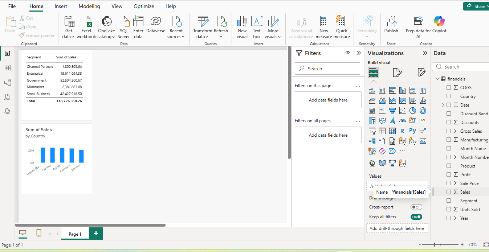

# Power BI Practice

My first hands-on Power BI project, built while learning the basics of Power BI Desktop.

## What's inside
- **Dataset:** Microsoft's built-in Financial Sample data
- **Visuals:**
  - Sum of Sales by Country
  - Sum of Sales by Segment
- **Skills practiced:** loading sample data, building bar charts, cross-filtering between visuals

## Screenshot

## Tools used
- Power BI Desktop
